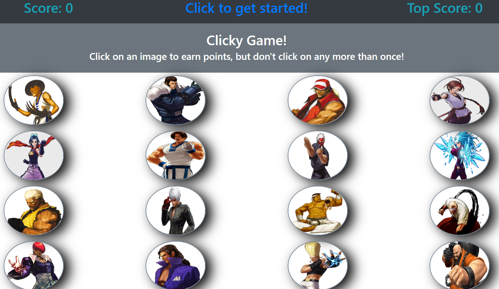

## Description

A game made in React using hooks, Bootstrap, and React Spring. Click on unique images to increment your score. The game resets if you click on an image you've already clicked on. The max score is 16.

## Methodology

Hooks help manage state by wrapping the whole page in a "GameContext" component. Props can be used anywhere by simply using the context hook. Nearly all of my game logic is inside of the GameState.js file, which runs a function to dispatch actions to the gameReducer.js file. Dispatched actions then update the game's state accordingly.

## Home Page Screenshot

